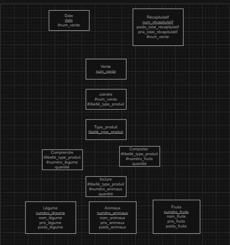

Modèle relationel :
 
Animaux (numéro_animaux, nom_animaux, prix_animaux, poids) 
Fruits (numéro_fruits, nom_fruits, prix_fruits) 
Légume (numéro_légume, nom_légume, prix_légumes, poids_légume) 
Date (date_Date, num_vente) 
Vente (num_vente_Vente) 
Récapitulatif (poids_total_Récapitulatif, prix_total_Récapitulatif, num_vente_Vente) 
Type_produit (libellé_Type_produit) 
Comprendre (libellé_Type_produit, numéro_légume, quantité) 
Inclure (libellé_Type_produit, numéro_animaux, quantité) 
Comporter (libellé_Type_produit, numéro_fruits, quantité) 
Joindre (num_vente_Vente, libellé_Type_produit) 

````SQL

CREATE TABLE Animaux (
    numero_animaux INT PRIMARY KEY AUTO_INCREMENT,
    nom_animaux VARCHAR(100) NOT NULL,
    prix_animaux DECIMAL(10, 2) NOT NULL,
    poids DECIMAL(10, 2) NOT NULL
);


CREATE TABLE Fruits (
    numero_fruits INT PRIMARY KEY AUTO_INCREMENT,
    nom_fruits VARCHAR(100) NOT NULL,
    prix_fruits DECIMAL(10, 2) NOT NULL
);


CREATE TABLE Legume (
    numero_legume INT PRIMARY KEY AUTO_INCREMENT,
    nom_legume VARCHAR(100) NOT NULL,
    prix_legumes DECIMAL(10, 2) NOT NULL,
    poids_legume DECIMAL(10, 2) NOT NULL
);


CREATE TABLE Date (
    date_date DATE PRIMARY KEY,
    num_vente INT,
    FOREIGN KEY (num_vente) REFERENCES Vente(num_vente_Vente)
);


CREATE TABLE Vente (
    num_vente_Vente INT PRIMARY KEY AUTO_INCREMENT
);


CREATE TABLE Recapitulatif (
    poids_total_Recapitulatif DECIMAL(10, 2) NOT NULL,
    prix_total_Recapitulatif DECIMAL(10, 2) NOT NULL,
    num_vente_Vente INT,
    FOREIGN KEY (num_vente_Vente) REFERENCES Vente(num_vente_Vente)
);


CREATE TABLE Type_produit (
    libelle_Type_produit VARCHAR(100) PRIMARY KEY
);


CREATE TABLE Comprendre (
    libelle_Type_produit VARCHAR(100),
    numero_legume INT,
    quantite INT NOT NULL,
    FOREIGN KEY (libelle_Type_produit) REFERENCES Type_produit(libelle_Type_produit),
    FOREIGN KEY (numero_legume) REFERENCES Legume(numero_legume)
);


CREATE TABLE Inclure (
    libelle_Type_produit VARCHAR(100),
    numero_animaux INT,
    quantite INT NOT NULL,
    FOREIGN KEY (libelle_Type_produit) REFERENCES Type_produit(libelle_Type_produit),
    FOREIGN KEY (numero_animaux) REFERENCES Animaux(numero_animaux)
);


CREATE TABLE Comporter (
    libelle_Type_produit VARCHAR(100),
    numero_fruits INT,
    quantite INT NOT NULL,
    FOREIGN KEY (libelle_Type_produit) REFERENCES Type_produit(libelle_Type_produit),
    FOREIGN KEY (numero_fruits) REFERENCES Fruits(numero_fruits)
);


CREATE TABLE Joindre (
    num_vente_Vente INT,
    libelle_Type_produit VARCHAR(100),
    FOREIGN KEY (num_vente_Vente) REFERENCES Vente(num_vente_Vente),
    FOREIGN KEY (libelle_Type_produit) REFERENCES Type_produit(libelle_Type_produit)
);


````