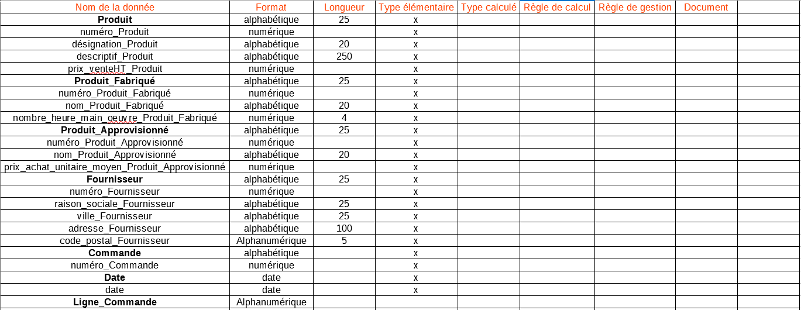
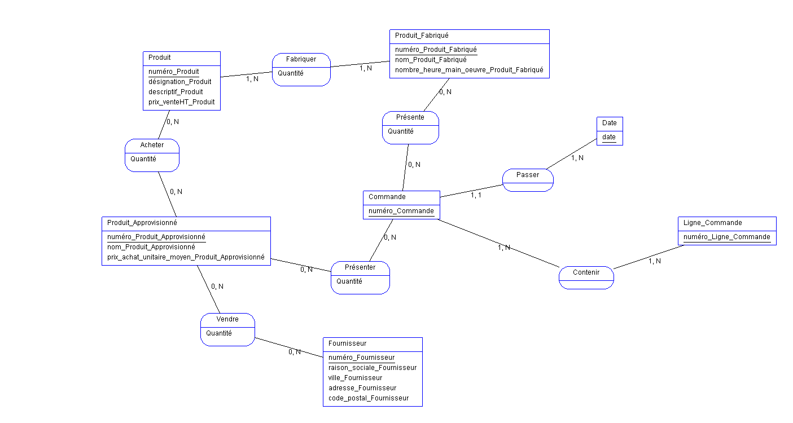
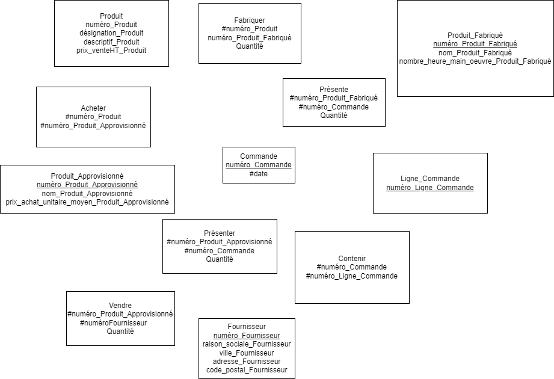

Dictionnaire :



MCD:



MLD : 

Les propiétés soulignées sont les clefs primaires.

Les propiétés qui commencent par un "#" sont les clefs étrangères.



MDP :

Produit (numéro_Produit, désignation_Produit, descriptif_Produit, prix_venteHT_Produit)
Produit_Fabriqué (numéro_Produit_Fabriqué, nom_Produit_Fabriqué, nombre_heure_main_oeuvre_Produit_Fabriqué)
Produit_Approvisionné (numéro_Produit_Approvisionné, nom_Produit_Approvisionné, prix_achat_unitaire_moyen_Produit_Approvisionné)
Fournisseur (numéro_Fournisseur, raison_sociale_Fournisseur, ville_Fournisseur, adresse_Fournisseur, code_postal_Fournisseur) 
Commande (numéro_Commande, #date_Date)
Date (date)
Ligne_Commande (numéro_Ligne_Commande)
Contenir (#numéro_Commande, #numéro_Ligne) 
Présente (#numéro_Produit_Fabriqué, #numéro_Commande, Quantité) 
Acheter (#numéro_Produit, #numéro_Produit_Approvisionné, Quantité)
Vendre (#numéro_Produit_Approvisionné, #numéro_Fournisseur, Quantité)
Fabriquer (#numéro_Produit, #numéro_Produit_Fabriqué, Quantité)  
Présenter (#numéro_Produit_Approvisionné, #numéro_Commande, Quantité)

````SQL

CREATE DATABASE examExercice1;

USE examExercice1;

CREATE TABLE Produit (
    numéro_Produit INT PRIMARY KEY,
    désignation_Produit VARCHAR(255),
    descriptif_Produit TEXT,
    prix_venteHT_Produit DECIMAL(10, 2)
);

CREATE TABLE Produit_Fabriqué (
    numéro_Produit_Fabriqué INT PRIMARY KEY,
    nom_Produit_Fabriqué VARCHAR(255),
    nombre_heure_main_oeuvre_Produit_Fabriqué DECIMAL(10, 2)
);

CREATE TABLE Produit_Approvisionné (
    numéro_Produit_Approvisionné INT PRIMARY KEY,
    nom_Produit_Approvisionné VARCHAR(255),
    prix_achat_unitaire_moyen_Produit_Approvisionné DECIMAL(10, 2)
);

CREATE TABLE Fournisseur (
    numéro_Fournisseur INT PRIMARY KEY,
    raison_sociale_Fournisseur VARCHAR(255),
    ville_Fournisseur VARCHAR(255),
    adresse_Fournisseur TEXT,
    code_postal_Fournisseur VARCHAR(10)
);

CREATE TABLE Date (
    date DATE PRIMARY KEY
);

CREATE TABLE Commande (
    numéro_Commande INT PRIMARY KEY,
    date_Date DATE,
    FOREIGN KEY (date_Date) REFERENCES Date(date)
);

CREATE TABLE Ligne_Commande (
    numéro_Ligne_Commande INT PRIMARY KEY
);

CREATE TABLE Contenir (
    numéro_Commande INT,
    numéro_Ligne INT,
    PRIMARY KEY (numéro_Commande, numéro_Ligne),
    FOREIGN KEY (numéro_Commande) REFERENCES Commande(numéro_Commande),
    FOREIGN KEY (numéro_Ligne) REFERENCES Ligne_Commande(numéro_Ligne_Commande)
);

CREATE TABLE Présente (
    numéro_Produit_Fabriqué INT,
    numéro_Commande INT,
    Quantité INT,
    PRIMARY KEY (numéro_Produit_Fabriqué, numéro_Commande),
    FOREIGN KEY (numéro_Produit_Fabriqué) REFERENCES Produit_Fabriqué(numéro_Produit_Fabriqué),
    FOREIGN KEY (numéro_Commande) REFERENCES Commande(numéro_Commande)
);

CREATE TABLE Acheter (
    numéro_Produit INT,
    numéro_Produit_Approvisionné INT,
    Quantité INT,
    PRIMARY KEY (numéro_Produit, numéro_Produit_Approvisionné),
    FOREIGN KEY (numéro_Produit) REFERENCES Produit(numéro_Produit),
    FOREIGN KEY (numéro_Produit_Approvisionné) REFERENCES Produit_Approvisionné(numéro_Produit_Approvisionné)
);

CREATE TABLE Vendre (
    numéro_Produit_Approvisionné INT,
    numéro_Fournisseur INT,
    Quantité INT,
    PRIMARY KEY (numéro_Produit_Approvisionné, numéro_Fournisseur),
    FOREIGN KEY (numéro_Produit_Approvisionné) REFERENCES Produit_Approvisionné(numéro_Produit_Approvisionné),
    FOREIGN KEY (numéro_Fournisseur) REFERENCES Fournisseur(numéro_Fournisseur)
);

CREATE TABLE Fabriquer (
    numéro_Produit INT,
    numéro_Produit_Fabriqué INT,
    Quantité INT,
    PRIMARY KEY (numéro_Produit, numéro_Produit_Fabriqué),
    FOREIGN KEY (numéro_Produit) REFERENCES Produit(numéro_Produit),
    FOREIGN KEY (numéro_Produit_Fabriqué) REFERENCES Produit_Fabriqué(numéro_Produit_Fabriqué)
);

CREATE TABLE Présenter (
    numéro_Produit_Approvisionné INT,
    numéro_Commande INT,
    Quantité INT,
    PRIMARY KEY (numéro_Produit_Approvisionné, numéro_Commande),
    FOREIGN KEY (numéro_Produit_Approvisionné) REFERENCES Produit_Approvisionné(numéro_Produit_Approvisionné),
    FOREIGN KEY (numéro_Commande) REFERENCES Commande(numéro_Commande)
);

``