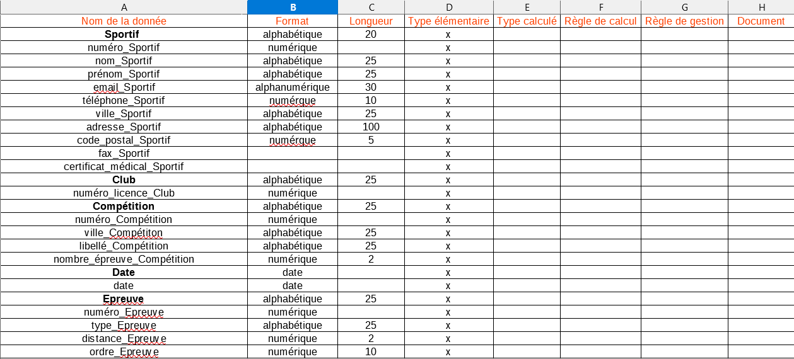

Dictionnaire : 



MCD : 


MLD : 

Les propiétés soulignées sont les clefs primaires.

Les propiétés qui commencent par un "#" sont les clefs étrangères.


MDP : 

Sportif (numéro_Sportif, nom_Sportif, prénom_Sportif, email_Sportif, téléphone_Sportif, ville_Sportif, adresse_Sportif, code_postal_Sportif, fax_Sportif, certificat_médical_Sportif)
Club (numéro_licence_Club) 
Compétition (numéro_Compétition, ville_Compétition, libellé_Compétition, nombre_épreuve_Compétition, #date_Date) 
Date (date) 
Epreuve (numéro_Epreuve, type_Epreuve, distance_Epreuve, ordre_Epreuve)
Enregistrer (#numéro_Sportif, #numéro_licence_Club)
Composer (#numéro_Compétitiion, #numéro_Epreuve)
Inscrire (#numéro_Compétitiion, #numéro_Sportif)

````SQL

CREATE DATABASE examExercice2;

USE examExercice2;

CREATE TABLE Sportif (
    numéro_Sportif INT PRIMARY KEY,
    nom_Sportif VARCHAR(25),
    prénom_Sportif VARCHAR(25),
    email_Sportif VARCHAR(30),
    téléphone_Sportif VARCHAR(10),
    ville_Sportif VARCHAR(25),
    adresse_Sportif VARCHAR(100),
    code_postal_Sportif VARCHAR(5),
    fax_Sportif VARCHAR(20),
    certificat_médical_Sportif DATE
);

CREATE TABLE Club (
    numéro_licence_Club INT PRIMARY KEY
);

CREATE TABLE Date (
    date DATE PRIMARY KEY
);

CREATE TABLE Compétition (
    numéro_Compétition INT PRIMARY KEY,
    ville_Compétition VARCHAR(25),
    libellé_Compétition VARCHAR(25),
    nombre_épreuve_Compétition INT,
    date_Date DATE,
    FOREIGN KEY (date_Date) REFERENCES Date(date)
);

CREATE TABLE Epreuve (
    numéro_Epreuve INT PRIMARY KEY,
    type_Epreuve VARCHAR(25),
    distance_Epreuve INT,
    ordre_Epreuve INT
);

CREATE TABLE Enregistrer (
    numéro_Sportif INT,
    numéro_licence_Club INT,
    PRIMARY KEY (numéro_Sportif, numéro_licence_Club),
    FOREIGN KEY (numéro_Sportif) REFERENCES Sportif(numéro_Sportif),
    FOREIGN KEY (numéro_licence_Club) REFERENCES Club(numéro_licence_Club)
);

CREATE TABLE Composer (
    numéro_Compétition INT,
    numéro_Epreuve INT,
    PRIMARY KEY (numéro_Compétition, numéro_Epreuve),
    FOREIGN KEY (numéro_Compétition) REFERENCES Compétition(numéro_Compétition),
    FOREIGN KEY (numéro_Epreuve) REFERENCES Epreuve(numéro_Epreuve)
);

CREATE TABLE Inscrire (
    numéro_Compétition INT,
    numéro_Sportif INT,
    PRIMARY KEY (numéro_Compétition, numéro_Sportif),
    FOREIGN KEY (numéro_Compétition) REFERENCES Compétition(numéro_Compétition),
    FOREIGN KEY (numéro_Sportif) REFERENCES Sportif(numéro_Sportif)
);


``
