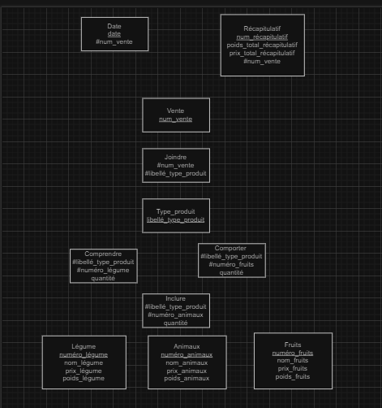

MPD :
 
Animaux (numéro_animaux, nom_animaux, prix_animaux, poids) 
Fruits (numéro_fruits, nom_fruits, prix_fruits) 
Légume (numéro_légume, nom_légume, prix_légumes, poids_légume) 
Date (date_Date, #num_vente_Vente) 
Vente (num_vente_Vente) 
Récapitulatif (poids_total_Récapitulatif, prix_total_Récapitulatif, #num_vente_Vente) 
Type_produit (libellé_Type_produit) 
Comprendre (libellé_Type_produit, numéro_légume, quantité) 
Inclure (libellé_Type_produit, numéro_animaux, quantité) 
Comporter (libellé_Type_produit, numéro_fruits, quantité) 
Joindre (num_vente_Vente, libellé_Type_produit) 
