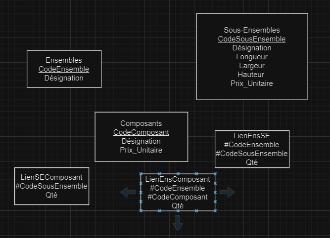
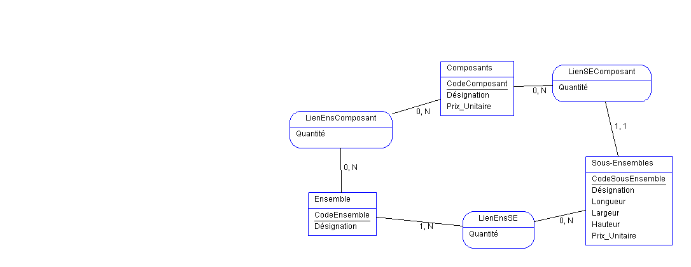

Modèle relationel 

Ensembles(CodeEnsemble, Désignation)
Sous-Ensembles(CodeSousEnsemble, Désignation, Longueur, Largeur, Hauteur, Prix_Unitaire)
Composants(CodeComposant, Désignation, Prix_Unitaire)
LienEnsSE(#CodeEnsemble, #CodeSousEnemble, Qté)
LienEnsComposant(#CodeEnsemble, #CodeComposant, Qté)
LienSEComposant(#CodeSousEnsemble, #CodeComposant, Qté)

MLD :

MCD : 

