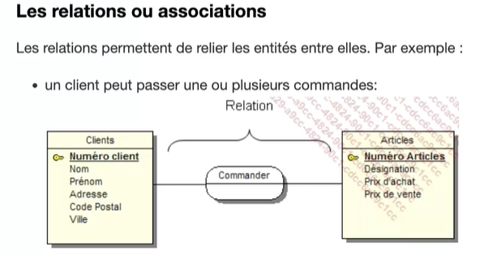
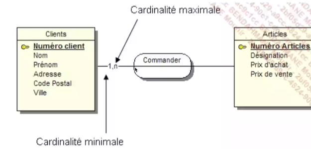
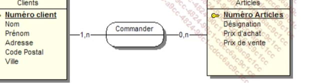
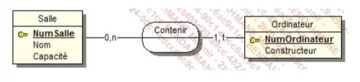
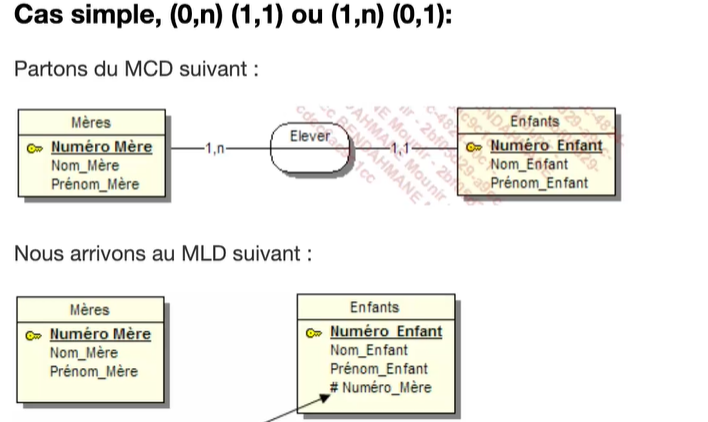
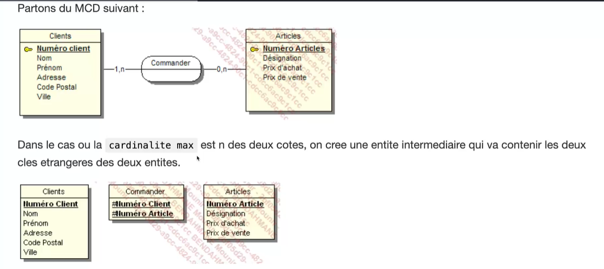

# Le recueil d'informations 

## Interview/enquête

## Etude des documents internes/externes

# Les types d'informations

## Les informations élémentaires

une information élémentaire doit être atomique : 

Bien découpé tous ces champs pour plus de vérification et de sureté 

'34, rue de la Paix, 75000 PARIS'

- 34 rue de la paix --> adresse 
- 75000 --> code postal
- Paris --> ville 

Une valeur prise par une information élémentaire est une occurence.

## Les informations calculées 

## Les traitements 

Automatique ou manuel 

## Approche nivelée 

niveau conceptuel 

niveau organisationnel

niveau logique 

niveau physique 

dependance fonctionelle : définis une relation de dependance entre deux attributs

relation symboliser par un verbe 

## Les cardinalités 

les cardinalités exprime le nombre de fois ou l'occurence d'une entité participe aux occurences de la relation

combien de fois un client peut-il commander un article ?

combien de fois au maximum un client peut-il commander un article ?

pour obtenir la caridnalité suivante, on se pose la même question, mais cette fois-ci l'entité Article

si elle est connue il faut le noter 

## Les relations porteuses 

porteuse quand elle possède des propiétés 

deux entités = relation binaire

trois entités = relation ternaire 

## Les relations reflexives 

elle est relie une entité à elle même 

# Règles conception

tout entité doit avoir un ID 

toutes les propriétés de l'entité depandent de l'ID

nom d'une propriété doit appaitre une seule fois (unique) dans tout le MCD pour rendre unique utiliser un préfixe/suffixe exemple : nom_suffixe

## Notion d'entité forte et d'entité faible 

entité forte : qui peut exister toute seule 

entité faible : associé à une autre entité 

## contrainte d'intégrité fonctionnelle 

Une CIF est définie par le fait qu'une des entités de l'association est completement déterminée par la connaissance d'une ou plusieurs entités participant à l'association 

# MLD (modèle logique de données)

L'entité qui possède la cardinalité 1,1 ou 0,1 absorbe l'identifiant de l'entité la plus forte (0,n ou 1,n). Cet identifiant devient alors une clef étrangère

clef étrangère représenté par #

Dans le cas, ou la cardinalité max est n des deux cotés, on cree une entité intermdédiaire qui va contenir les deux clefs étrangères des deux entités 

